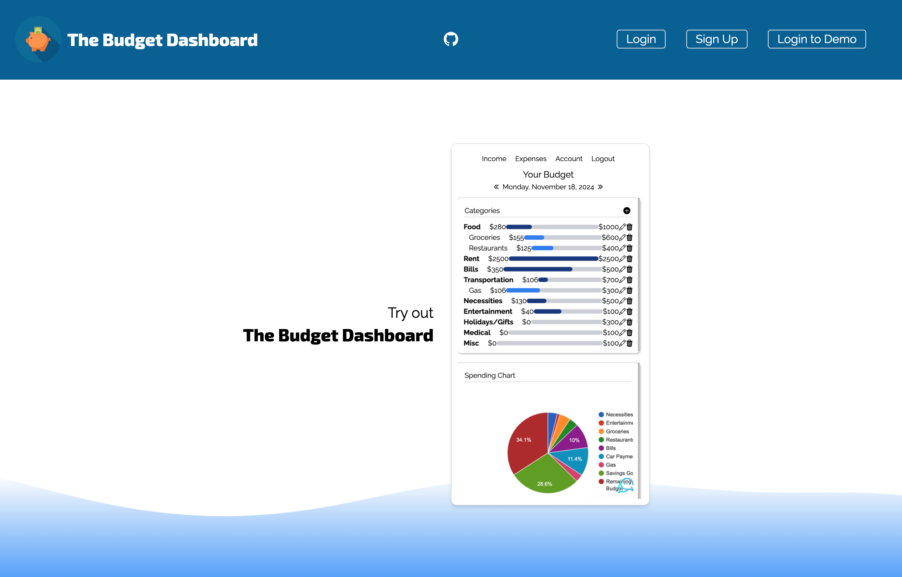
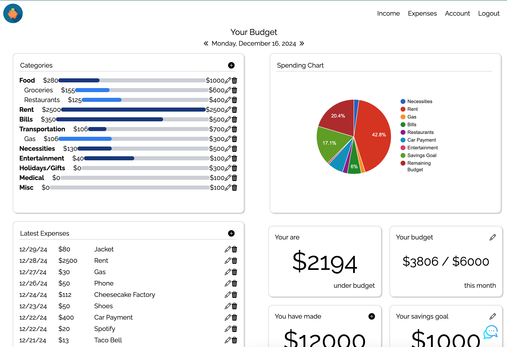

# The Budget Dashboard

Track your spending, budgets and savings goals.

# Description

This project is a full-stack application that allows users to track their spending, organize their expenses, easily work with their budgets and create goals for savings. They will be able to login, switch between months and chat with an AI to get spending advice and more.

Technologies used in this application include:
- NextJS
- React
- MySQL
- Sequelize
- Tailwind
- JWT Token
- ChatGPT API

# Usage

This application has been deployed at:

# Credits

This project was created by Justin Chun and Ramita Indurkhya.